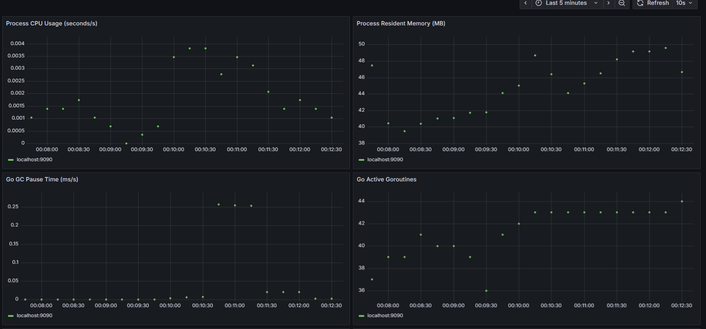
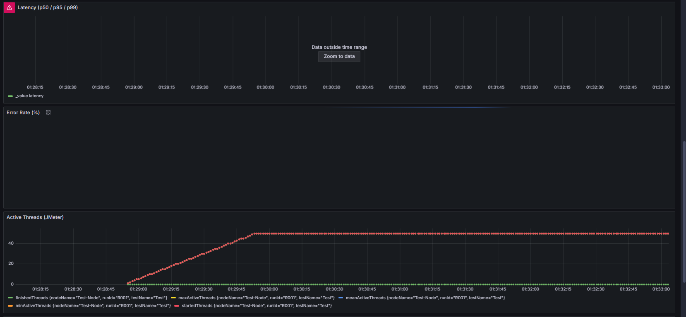
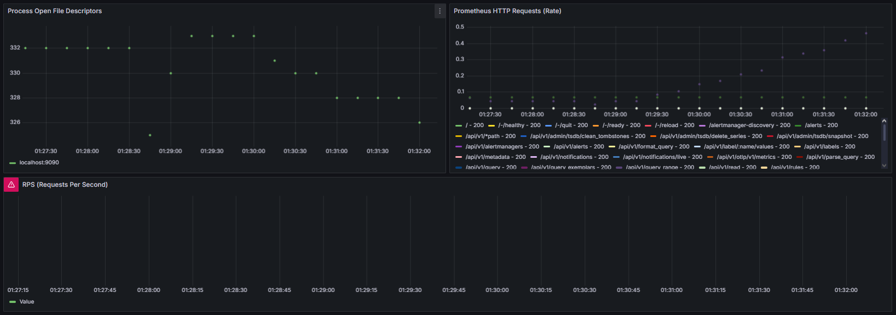
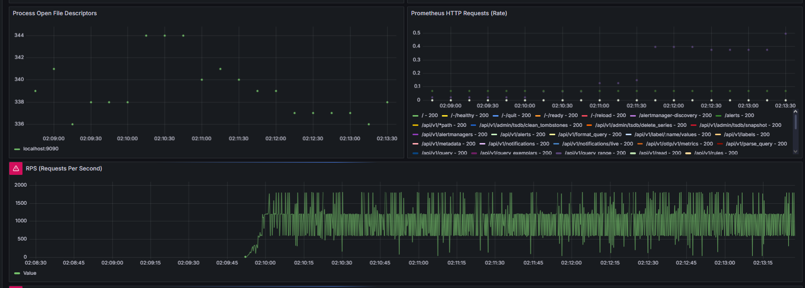
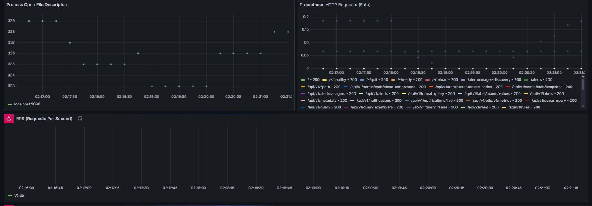

# Benchmark Project

This repository contains benchmark performance testing results across different scenarios and variants.

## Project Structure

- **Benchmark-Variant-A**: Java JAX-RS benchmark application (Variant A)
- **benchmarkD**: Benchmark variant D application
- **benchmarkR**: Benchmark variant R application
- **JMeter Test Files**: Load testing configurations
- **Benchmark Results**: Performance test images and reports

## Benchmark Results

### Scenario 1 - READ-heavy Operations

#### Variant A



#### Variant C




#### Variant D


### Scenario 2 - Mixed Operations

#### Variant A




#### Variant C




#### Variant D


### Scenario 3 - Heavy Operations

#### Variant A


#### Variant C


#### Variant D


## JMeter Test Files

- `Scenario 1 - READ-heavy.jmx` - Read-heavy operation tests
- `HEAVY-body (Paliers 30-60).jmx` - Heavy body tests with load levels 30-60
- `MIXED (Paliers 50-100).jmx` - Mixed operation tests with load levels 50-100
- `items.jmx` - Item-related tests
- `JOIN-filter .jmx` - Join filter tests

## Test Data Files

- `item_ids.csv` - Item identifiers for testing
- `category_ids.csv` - Category identifiers for testing
- `payload_item_1k.csv` - 1K item payload dataset
- `payload_item_5k.csv` - 5K item payload dataset
- `payload_category_1k.csv` - 1K category payload dataset

## Reports

- `Rapport_Benchmark.pdf` - Comprehensive benchmark report

## Variants

This project tests three different implementation variants:

- **Variant A**: Initial implementation in `Benchmark-Variant-A/`
- **Variant C**: Alternative implementation in `benchmarkR/`
- **Variant D**: Alternative implementation in `benchmarkD/`

Each variant is tested across multiple scenarios with different load profiles to measure performance differences.

## Getting Started

### Build Instructions

#### Variant A
```bash
cd Benchmark-Variant-A
./mvnw clean package
```

#### Variant D
```bash
cd benchmarkD/benchmarkD
./mvnw clean package
```

#### Variant R
```bash
cd benchmarkR/benchmarkR
./mvnw clean package
```

## Performance Metrics

The benchmark tests measure:
- Response times
- Throughput
- Error rates
- Resource utilization

Results are captured in the image files organized by scenario and variant.

---

Generated for comparison of benchmark variants A, C, and D across three test scenarios.
